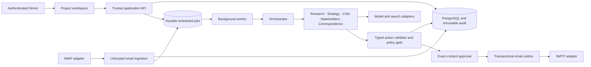
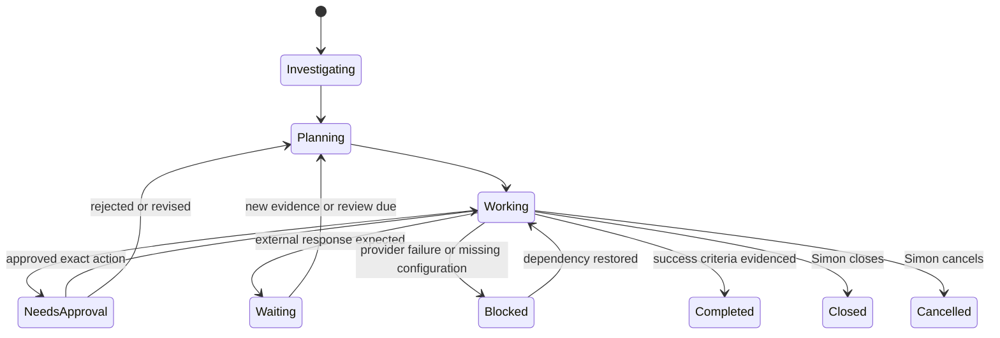

# Bob — architecture and implementation contract

Bob is a persistent project system. Models propose typed actions; trusted application code owns execution, permissions, state, identity, scheduling and audit. A completed action never implies a completed objective.

## 1. System architecture

The hosted web surface uses React and TypeScript. Production is the existing carrtech.dev server, ctlnxdbn001, using a separate Docker Compose stack. A dedicated FastAPI service owns PostgreSQL records and a durable PostgreSQL job queue (leased rows with retry schedules). Separate worker processes run research, planning and mailbox polling without an open browser. SMTP and IMAP remain backend adapters, never model tools. Docker Compose provides the initial deployment. The hosted UI can be developed independently of the service; demo records must be labelled and may never be represented as real research or correspondence.

## 2. Database model

All project-owned entities include project_id. API queries also constrain owner_id through the parent project. UUID keys and foreign keys prevent accidental association; a caller-provided project ID is never authorization.

| Entity | Key fields and invariants |
|---|---|
| users | id, authenticated subject, name |
| projects | id, owner_id, original_request, objective, success_criteria, understanding, status, next_review_at, version |
| plan_versions | id, project_id, version, strategy, evidence_ids, created_at; append only |
| actions | id, project_id, plan_version_id, type, schema_version, payload, rationale, benefit, dependencies, priority, status, estimated_cost, timestamps, outcome |
| research_items | id, project_id, source_url, title, accessed_at, excerpt, interpretation, epistemic_class, confidence, strategy_effect, trust |
| stakeholders | id, project_id, name, organisation, role, public_contacts, relevance, influence, position, next_action |
| stakeholder_relationships | project_id, from_id, to_id, relationship |
| email_accounts | id, owner_id, SMTP/IMAP metadata, encrypted_secret_reference; no cleartext credentials |
| email_messages | id, project_id, account_id, message_id, in_reply_to, references, raw_object_ref, plain_text, direction; unique(account_id,message_id) |
| email_drafts | id, project_id, version, to, cc, subject, body, rationale, intended_outcome, state |
| approvals | id, project_id, draft_id, draft_version, canonical_content, sha256, approved_by, approved_at, execution_at, result; immutable content |
| outbox | id, approval_id unique, state, message_id unique, attempts, error_class; ambiguous delivery requires reconciliation |
| jobs | id, project_id, kind, payload, idempotency_key unique, available_at, lease_until, attempts, state |
| events / decision_logs | id, project_id, actor, event_type, safe summary, evidence_ids, confidence, created_at; append only |
| model_calls | id, project_id, provider, model, operation, input/output/cached tokens, billable_units, pricing_snapshot, estimated_cost, timestamp |
| documents | id, project_id, title, object_ref, MIME, trust, quarantine_state |
| security_events | project_id, category, safe_summary, timestamp; never credentials or raw prompts |
| settings | owner_id/project_id, model routing, pricing, budgets, waiting intervals |

## 3. Agent workflow

Create objective → enqueue investigation → retrieve scoped memory → research candidate locations and authorities → record source-grounded facts and uncertainty → stakeholder discovery → strategy proposal → critic review → schema and policy validation → append plan version → select highest-value permitted action. Draft correspondence enters approval, never sends directly. Incoming evidence triggers a new assessment. Record concise decision summaries, never hidden chain-of-thought.

Provider interface: generate(role, trusted_policy, project_context, untrusted_evidence, output_schema) → validated proposal + measured usage. Search interface: search(query) → source candidates; fetch is mediated by a network boundary. Providers have no SQL, shell, secrets or SMTP tools. Task routing selects models independently. Missing credentials and provider errors yield visible blocked/retry states, never fabricated findings.

## 4. Security and trust

Precedence: application policy > authenticated Simon > project policy > approved strategy > application data > public research > websites > emails > attachments. Lower-trust data may support a factual conclusion but cannot authorize actions. Keep evidence envelopes separate from instructions and retain source/trust metadata.

Authentication, same-origin/CSRF checks, project ownership checks, strict payload schemas, parameterized SQL, secure cookies, CSP and rate limits belong to the API. Secrets use an authenticated encryption/secret-manager adapter; encryption keys live outside the database. Do not include credentials in model context, logs or audit snapshots. External text is rendered as text. Attachments remain quarantined; never execute, auto-open or pass to tools. Public URL fetching rejects non-HTTPS, credentials, local/private/link-local/multicast addresses, nonstandard ports and redirects into forbidden networks; validate DNS at connection time and use restricted egress. Prompt heuristics are diagnostic only, not a security boundary.

Only Simon Carr's name, the explicitly permitted address and Bob's email are generally disclosable. Other disclosure requires a scoped user authorization. Project context retrieval never includes unrelated projects. External identity: “Bob, the AI-powered assistant of Simon Carr.”

## 5. Typed actions and permissions

Discriminated action types: SEARCH_WEB, READ_WEB_PAGE, SEARCH_MAP, ADD_RESEARCH, ADD_STAKEHOLDER, UPDATE_PROJECT_PLAN, CREATE_EMAIL_DRAFT, REQUEST_USER_APPROVAL, SEND_APPROVED_EMAIL, CHECK_MAILBOX, ANALYSE_EMAIL, CREATE_DOCUMENT, WAIT_FOR_RESPONSE, REASSESS_PROJECT, CLOSE_PROJECT. Each schema rejects unknown fields. SEND_APPROVED_EMAIL accepts only an approval ID, never model-provided message content. CLOSE_PROJECT requires explicit user closure or documented success-criteria evidence.

Autonomous: public research, analysis, internal plans/documents and drafts. Explicit approval: every external email, form submission, publication, petition, media contact, spending, signing/terms and additional private disclosure. Prohibited: impersonation, fabricated evidence, harassment, security bypass, arbitrary command execution or untrusted instructions. Unknown action types fail closed. Content risk checks supplement explicit approval, not replace it.

## 6. Project state machine

Pause/resume is user-controlled. Action status is separate from project status. A due review evaluates whether to continue waiting; it does not automatically chase a recipient. Follow-ups require approval and respect a minimum contact interval.

## 7. Email architecture and approval integrity

Canonicalize the complete envelope and body, including recipients, CC, subject, attachments and identity. In one transaction, lock the draft, validate its version, persist immutable approved bytes plus hash, and enqueue a unique outbox item. Editing produces a new draft version and invalidates pending approval. Execution reads only approved bytes and checks the digest. It cannot send the mutable draft. Repeated approval requests return the existing result.

An SMTP timeout after DATA may mean delivery occurred. Mark delivery uncertain and reconcile using the stable Message-ID; never blindly retry ambiguous delivery. IMAP ingestion deduplicates using account and UIDVALIDITY/UID plus Message-ID, stores raw bytes safely, then matches References/In-Reply-To and known thread IDs within the account/project. Ambiguous associations produce a sender-clarification email draft in the shared inbox approval queue. Simon approves it before delivery. The original email remains unassigned until resolved; subject alone cannot assign a project. All projects share one dedicated SMTP/IMAP account. Attachments are quarantined and MIME/size checked. Analysis produces evidence and proposed actions, not trusted commands.

## 8. Background jobs

Workers atomically claim ready rows with leases and SKIP LOCKED. Unique idempotency keys, bounded exponential backoff and dead-letter states make retries observable. A scheduler enqueues mailbox polls and due project reviews. Persist state transitions and the next job in one transaction. Restarting a worker resumes durable jobs. Budgets and maximum steps constrain each run. Unknown SMTP delivery is not retried automatically.

## 9. User interface

Projects dashboard: objective composer, active projects, approval count, waiting states, cost and recent activity. Project workspace: Overview, Plan, Activity, Research, Stakeholders, Emails, Approvals, Documents, Costs and Settings. Overview exposes understanding, success criteria, current strategy and next action. Global approvals support review, edit, rewrite and reject with exact-content review. Configuration shows separate AI, search and email readiness. Diagnostics show safe errors and retry state. All seeded examples are clearly distinguished from live project data.

## 10. Phased implementation

1. Architecture, schema, permission engine and immutable approval tests.
2. Persistent project workspace, plans, timeline and draft review; explicit configuration states.
3. Provider-backed research → critic-reviewed strategy → draft vertical slice with costs.
4. Authenticated SMTP outbox and IMAP ingestion; adversarial, threading, concurrency and failure tests.
5. Durable scheduler, reassessment, wait policy, privacy controls and operational diagnostics.
6. Stakeholder graph, document quarantine/scanning, OAuth, deployment hardening and recovery exercises.

Production release requires all security-critical integration tests, real provider and mail sandbox tests, migration/restore verification, secret provisioning and operational review. An attractive preview is not evidence that these gates passed.
